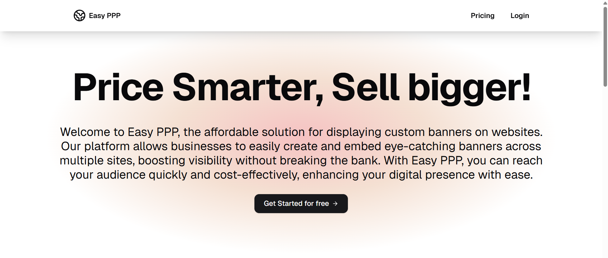
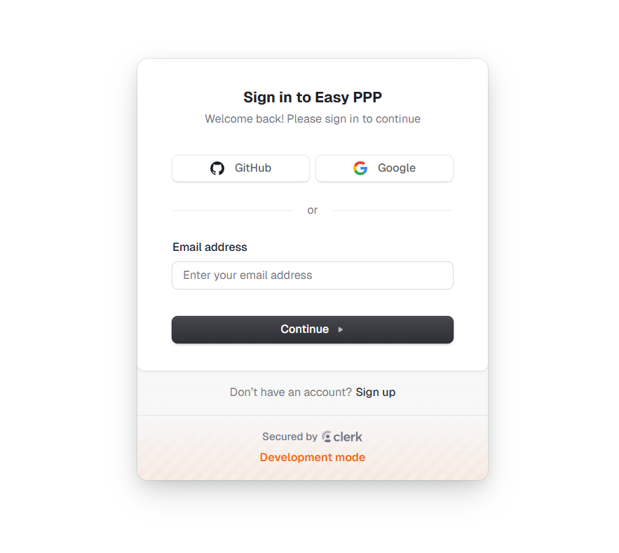
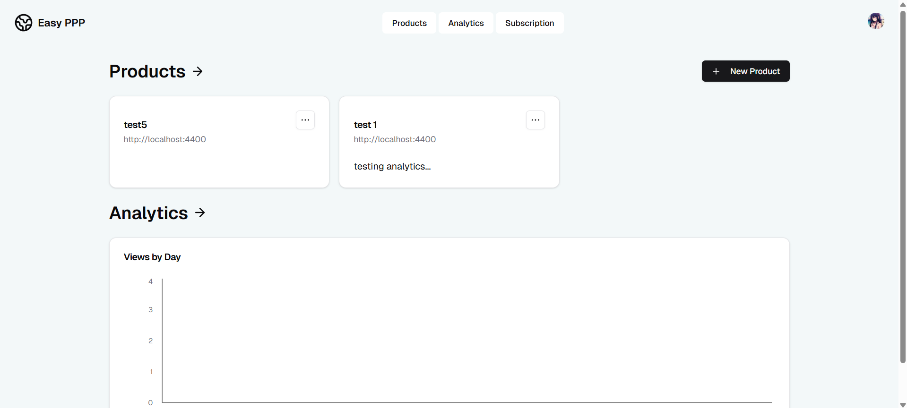
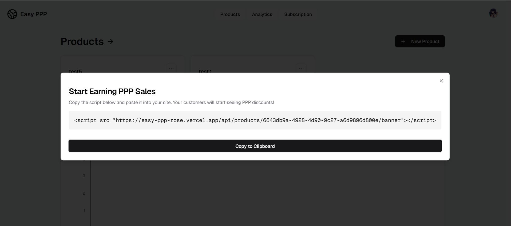
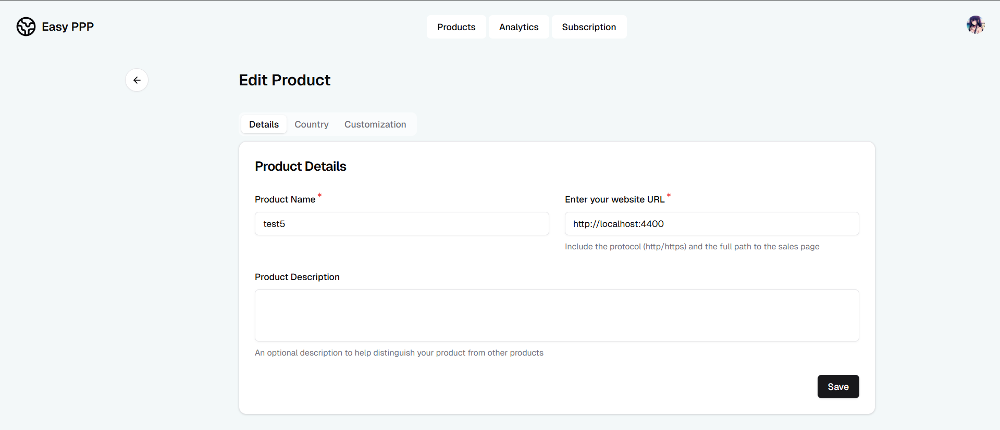
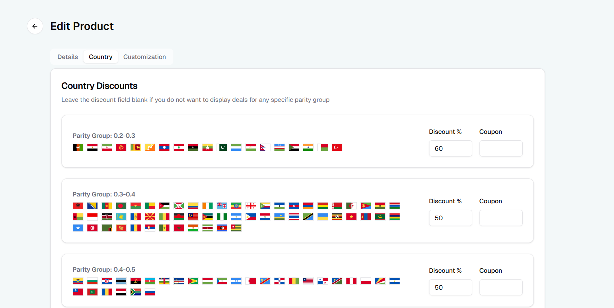
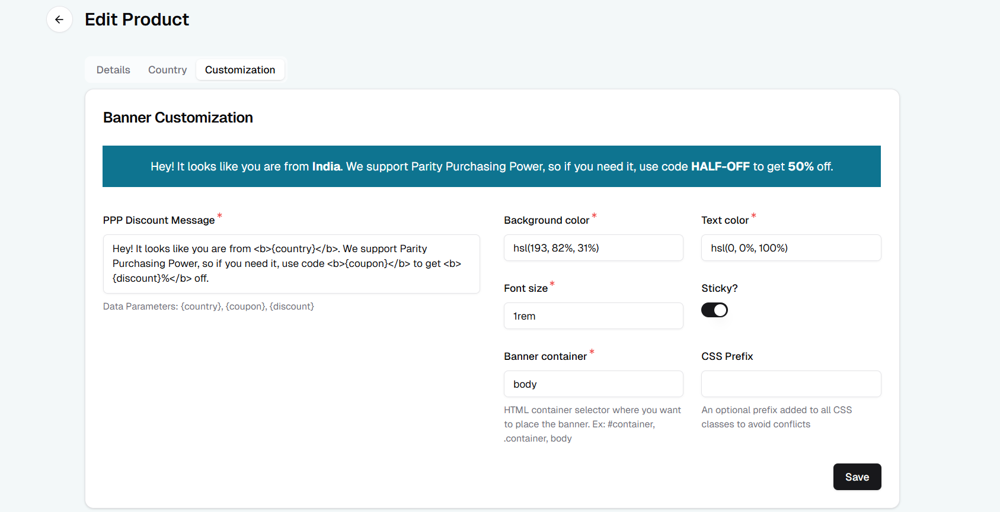
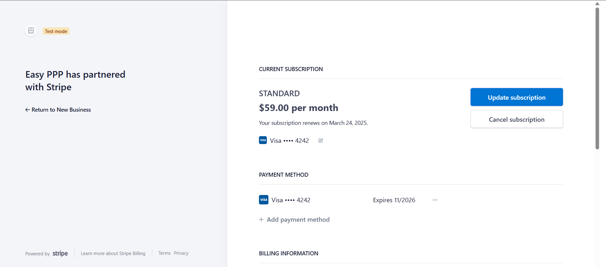
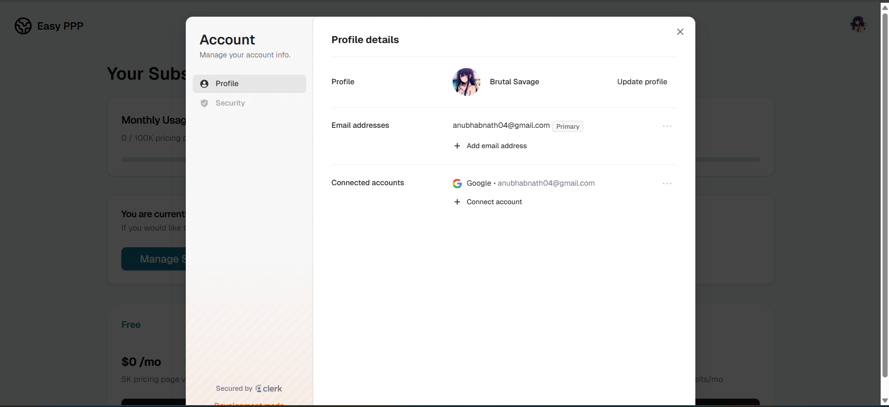

# 💼 Dynamic Discount Banner SaaS Platform

A full-stack, scalable SaaS platform that enables users to display dynamic discount banners on their websites, customized by country groups based on Purchasing Power Parity (PPP). Built with Next.js, Drizzle ORM, NeonDB, Clerk, and Stripe.

---

## ✨ Features

* 🎯 **Dynamic Discount Banners** tailored for 10 PPP-based country groups
* 🌐 **Multi-domain Management** to handle discount configurations across various client websites
* 🧩 **Custom Banners** with unique coupon codes, discount percentages, and appearance options
* 📊 **Interactive Dashboard** with real-time analytics & bar graphs segmented by product, time, and location
* 💳 **Stripe Integration** for subscription management with 4 subscription tiers
* 🔐 **Clerk Integration** for seamless user authentication and management

---

## 🛠️ Tech Stack

* **Frontend:** Next.js (with Turbopack)
* **Backend:** API Routes (Next.js)
* **Database:** NeonDB (PostgreSQL) via Drizzle ORM
* **Authentication:** Clerk
* **Payments:** Stripe

---

## 📦 Environment Variables

Create a `.env` file in the root directory with the following keys:

```env
# Database
DATABASE_URL=

# Clerk
NEXT_PUBLIC_CLERK_PUBLISHABLE_KEY=
CLERK_SECRET_KEY=
CLERK_WEBHOOK_SECRET=
NEXT_PUBLIC_CLERK_SIGN_IN_URL=/sign-in
NEXT_PUBLIC_CLERK_SIGN_UP_URL=/sign-up
NEXT_PUBLIC_CLERK_SIGN_IN_FORCE_REDIRECT_URL=/auth/callback
NEXT_PUBLIC_CLERK_SIGN_UP_FORCE_REDIRECT_URL=/auth/callback

# Stripe
STRIPE_SECRET_KEY=
STRIPE_BASIC_PLAN_ID=
STRIPE_STANDARD_PLAN_ID=
STRIPE_PREMIUM_PLAN_ID=
STRIPE_WEBHOOK_SECRET=

# Other
NEXT_PUBLIC_SERVER_URL=http://localhost:3000

# Development
TEST_COUNTRY_CODE=IN
```

---

## 🧑‍💻 Getting Started

### 1. Clone and Install Dependencies

```bash
git clone https://github.com/your-username/your-repo-name.git
cd your-repo-name
npm install
```

### 2. Set Up Environment

Create a `.env` file in the root with the provided keys above.

### 3. Populate Database

Run the following scripts to initialize the database and update country groups:

```bash
npm run db:migrate
npm run db:generate
npm run db:updateCountryGroups
```

### 4. Start Stripe Webhook Listener

Make sure the Stripe CLI is installed. Then, run:

```bash
npm run stripe:webhooks
```

This forwards webhook events to your local server.

### 5. Start the Dev Server

```bash
npm run dev
```

---

## 🔌 Webhooks Setup

### Stripe Webhooks

Ensure the Stripe CLI is configured and running. The webhook secret must match `STRIPE_WEBHOOK_SECRET` in your `.env` file.

### Clerk Webhooks

Set your Clerk webhook endpoint to:

```
https://yourdomain.com/api/webhooks/clerk
```

And use the matching secret `CLERK_WEBHOOK_SECRET` in your `.env`.


## screenshots of the project

### 1. Home Page


### 2. login page
  

### 3. Dashboard page
  

### 4. Add to site url


### 5. edit product page/add product page (url or domain where banner is to be displayed)
  

### 6. Add discount based on parity of country groups  


### 7. Customize banner 


### 8. Analytics Page
 

### 9. Subscription Page


### 10. Manage Subscription through Stripe


### 11. Manage Account through Clerk Page 


