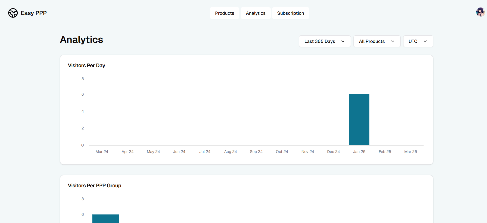
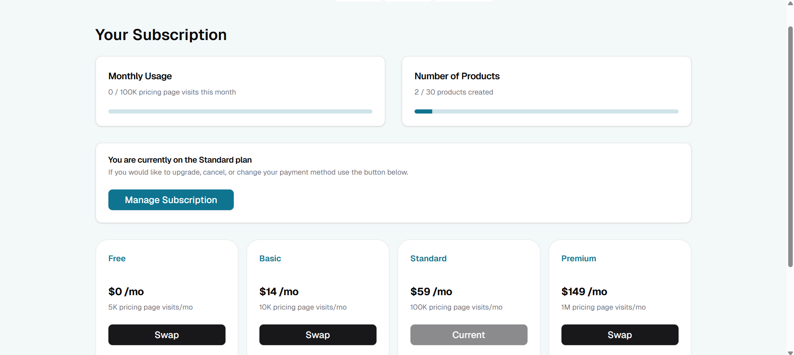

## To run this project in your localhost    
1. npm install
2. initialise all the environment variables in .env file
3. npm run dev

## screenshots of project

### 1. Home Page

### 2. login page
  

### 3. Dashboard page
  

### 4. Add to site url

### 5. edit product page/add product page (url or domain where banner is to be displayed)
  

### 6. Add discount based on parity of country groups  

### 7. Customize banner 

### 8. Analytics Page
 

### 9. Subscription Page

### 10. Manage Subscription through Stripe

### 11. Manage Account through Clerk Page 

